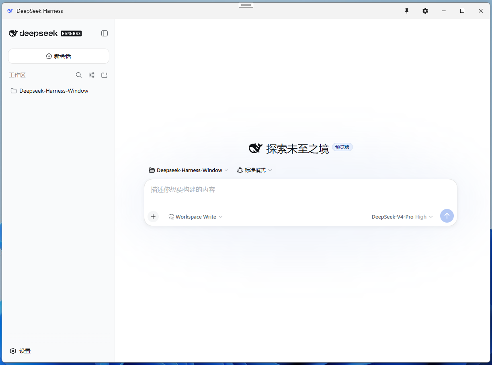
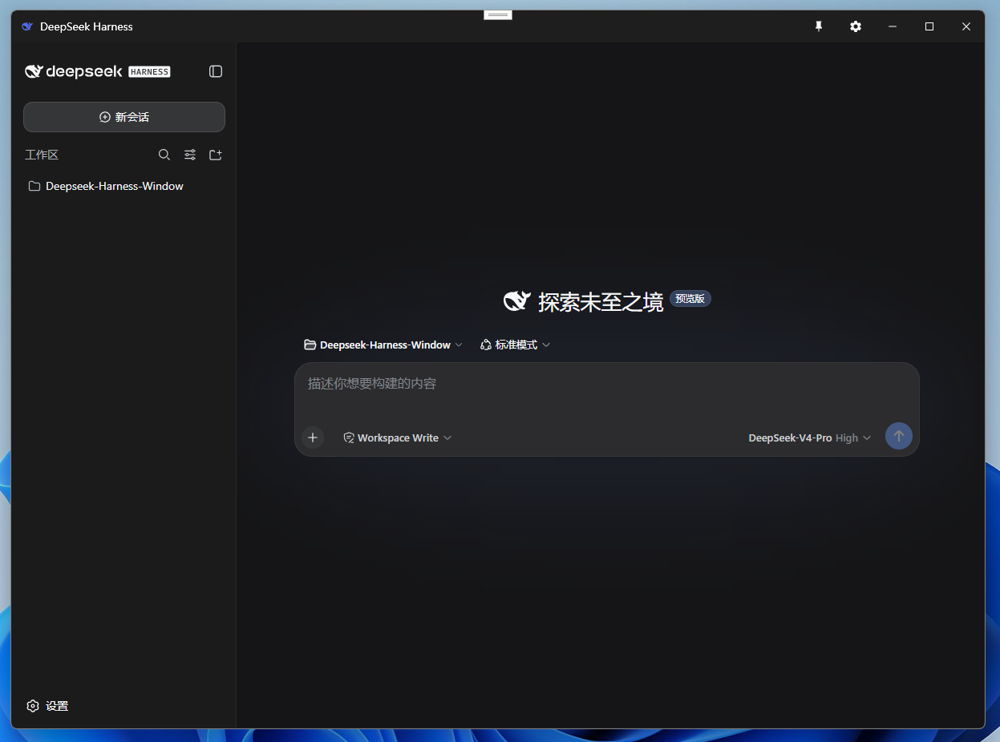
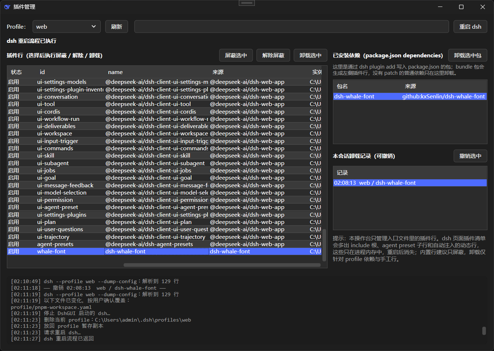

# DshGUI

DeepSeek Harness（`dsh`）的 Windows WPF 启动器：把 `dsh web` 的界面装进一个原生窗口——双击打开、不用浏览器，并补上浏览器做不到的原生能力（崩溃插件清理、系统托盘、完成通知、全局快捷键、开机自启、权限提醒等）。

## 技术栈

| 层 | 技术 |
|---|---|
| 界面 | WPF（.NET 10，`net10.0-windows`） |
| 内嵌内容 | WebView2（Edge 的 Chromium 内核，渲染 dsh 的 Web UI） |
| 架构 | MVVM（`ViewModelBase` + `RelayCommand`，无第三方框架） |
| 运行时依赖 | 系统自带的 WebView2 Runtime（Win10/11 默认有）与 Node.js（运行 dsh 需要）；无其他大体积依赖 |

## 界面

<div align="center">
  
  
  <br />
  
</div>

## 工作原理

1. 启动时检测 dsh 是否已安装（在 PATH 里找 `dsh.cmd`）或已在运行（轮询设置中指定的端口，默认 `http://127.0.0.1:3080`）。
2. 未装 Node.js/npm → 加载面板提示「下载 Node.js + 重新检测」。
3. 有 Node.js 但未装 dsh → 加载面板内选择 npm 镜像源（官方 / 国内镜像），一键 `npm install -g @deepseek-ai/dsh --registry <源>`，安装日志实时滚动。
4. 已装 → 以子进程拉起 `dsh --profile <profile> --port <端口> --no-open`（默认 `web`），轮询端口就绪，启动期间面板显示日志与计时；dsh 0.1.2+ 会从输出中解析一次性访问令牌并自动带上。
5. WebView2 打开该地址。
6. WPF 与页面通过 WebView2 的 JS ↔ C# 桥接通信：注入脚本监听 **① agent 运行状态**（`data-state="ongoing"` / `data-running`）、**② 深色主题**（`data-ds-dark-theme`）、**③ 当前会话标题**、**④ 权限审批**（`data-approval-key`）。

## 已实现功能

### 启动、安装与设置

- **原生窗口外观**：灰色外轮廓、圆角、阴影；`WindowChrome` 保留拖拽/缩放/贴边/双击最大化。
- **加载面板**：启动/安装/更新期间显示状态文字、不确定进度条、已用计时与滚动日志。
- **Node.js 前置检测**：未装 Node.js 时提示下载官网 + 重新检测。
- **安装引导（内嵌，不弹窗）**：选择镜像源 → 立即安装 → 日志滚动 → 自动启动。
- **npm 镜像源**：官方源 / 国内镜像（npmmirror）可选，安装、更新、检查更新三处共用。
- **dsh 端口可配置**：默认 3080；避开系统保留端口与常见服务端口，保存时校验端口占用，变更后自动按新端口重启连接；设置面板另有「重启 DeepSeek Harness」按钮，按当前设置（含新端口）一键重启。
- **Profile 切换器（标题栏下拉）**：选择 `$DSH_HOME\profiles` 下的 profile（默认 `web`）启动；切换即停止当前 dsh 并按新 profile 重启，不同 profile 的会话/插件数据相互隔离。
- **新版 dsh 令牌鉴权兼容**：dsh 0.1.2+ 的 Web 访问启用一次性令牌（打印在启动地址 `?token=…`）；DshGUI 自己启动的实例自动从输出解析，外部启动的实例则提示粘贴启动地址；0.1.1 及更早版本无令牌，直接兼容。
- **设置面板（内嵌抽屉）**：主题 / 镜像源 / dsh 端口 / 忙完通知 / 开机自启 / 全局快捷键录制。
- **检查更新**：在设置面板内手动检查；按 SemVer 分别比较 `latest` 与 `next` 两个 npm dist-tag。`latest` 用于更新到最新版，`next` 作为可选预览版（例如 `-rc.x`）单独显示，不弹窗打扰。检查结果附带 npm 上全部已发布版本的下拉列表，可任选一个版本安装（含未打 `latest` 标签的预览版）；版本号兼容 `dsh-v` 前缀，本地版本未知时也不会误报「已是最新」。更新时先停止 dsh（只停 DshGUI 自己启动的实例），再复用加载面板显示安装日志，完成后自动重启。

### 托盘、通知与快捷操作

- **系统托盘**：`×` 缩到托盘、`─` 最小化到任务栏；右键菜单「打开 / 插件管理 / 退出」。
- **忙完通知**：agent 空闲且窗口最小化/托盘时弹 Toast，带会话标题，点击回主窗口。
- **权限审批提醒**：窗口不在前台时弹持久 Toast，点击唤起窗口，审批解决后自动消失。
- **全局快捷键**（可录制，默认关）：显示/隐藏窗口。
- **开机自启**：在用户 Startup 文件夹创建 `DshGUI.lnk` 快捷方式（启动时自动清理旧版注册表项）；可选「静默到托盘」——窗口从不显示（零闪屏），dsh 在后台启动，托盘打开时看到加载进度。
- **单实例**：二次启动打开已有窗口。

### 插件管理

- **操作台（标题栏拼图按钮）**：独立窗口查看各 Profile 实际加载的插件行（id/name/来源/实体/状态）。
- **屏蔽 / 解除屏蔽**：运行中的 dsh 先弹红色停止按钮，内置核心行有启动失败警告，修改后提示手动重启。
- **卸载**：官方依赖走 `dsh plugin remove`，手工插件同步删除实体与 patch 引用，内置行只提供屏蔽。
- **插件包导出 / 导入**：`.dshpkg` 携带入口配置与本地插件源码；导入前显示重名与新增列表，可在弹窗中选择目标 Profile，已有插件不替换，本地插件离线恢复。
- **会话内撤销**：卸载前完整暂存 profile，冲突文件会列出并确认；DshGUI 退出后撤销副本清理。
- **离线恢复**：dsh 因插件崩溃/卡死时仍可按入口文件盘点，屏蔽或卸载可疑插件后重启。

### 界面与状态

- **深色/浅色主题**（跟随系统/浅色/深色）：壳标题栏 ↔ 网页主题联动；插件管理弹窗标题栏与滚动条同样跟随。
- **窗口置顶**（标题栏图钉）。
- **标题栏实时显示当前会话名**。
- **记住状态**：窗口大小/位置/是否最大化 + 上次主题。
- **应用图标 / 托盘图标**（dsh 鲸鱼 logo，多尺寸 `.ico`）。

## 使用指南

### 首次启动
1. 双击运行 DshGUI。
2. 程序自动检测 Node.js 与 dsh：
   - 未装 Node.js → 点「下载 Node.js」前往官网装 LTS 版，装完点「重新检测」。
   - 未装 dsh → 在面板里选镜像源（默认官方，网络慢可选国内镜像），点「立即安装」，等日志滚动到「安装完成」后自动进入界面。

### 日常使用
- 关闭按钮 `×` 缩到系统托盘（后台继续运行）；托盘右键菜单可「打开 / 插件管理 / 退出」。
- 标题栏图钉可让窗口始终置顶。
- 当前会话名会实时显示在标题栏。

### 通知与权限
- **忙完通知**：agent 空闲且窗口最小化/在托盘时，右下角弹提示，点击回主窗口。
- **权限审批**：dsh 请求权限且窗口不在前台时，右下角弹持久提示，点击回到窗口处理；批准后提示自动消失。

### 设置
- 点标题栏齿轮打开右侧抽屉，可设置：主题（跟随系统/浅色/深色）、npm 镜像源、dsh 端口、忙完通知、开机自启（可勾选「静默到托盘」）、全局快捷键（点「录制」后按组合键）。
- dsh 端口默认 3080；系统保留端口与 RDP/数据库等常用服务端口会被拒绝，新端口已被占用时保存会弹窗确认。
- 标题栏下拉可切换 dsh profile（切换会重启 dsh）。
- 设置页可「关闭 / 重启 DeepSeek Harness」：只影响 DshGUI 自己启动的实例；外部手动启动的 dsh 不会被停止。

### 插件管理
- 点标题栏拼图按钮或托盘菜单「插件管理」打开操作台。
- 左侧是入口文件实际加载的插件行；右侧「已安装依赖」列出 `package.json.dependencies`，bundle 包会生成左侧插件行，普通依赖只能从右侧卸载。
- 选中插件行可「屏蔽 / 解除屏蔽」：运行中的 dsh 会先弹红色「停止 DeepSeek Harness」按钮；内置核心行有启动失败警告；写 profile（或 home）的 `cordis.patch.yml`，完成后提示手动重启 dsh。
- 选中依赖或手工插件行可「卸载」：官方依赖走 `dsh plugin remove`，手工行同步删实体与 patch 引用；内置行只提供屏蔽。
- 「导出插件包」把入口配置与本地插件源码打成 `.dshpkg`，不打包 node_modules；「导入插件包」先做格式自检，再显示重名/新增列表，勾选要导入的插件并选择目标 Profile；已有插件不替换，本地插件离线恢复，远程插件按 lockfile 重建。
- 导入前会备份当前 Profile，自动保留最近 5 份，更早的备份自动清理。
- 右侧「本会话卸载记录」可撤销本次 DshGUI 运行期间的卸载；卸载后文件被改动时，撤销前会列出变化文件并要求确认；DshGUI 退出后撤销副本清理。
- dsh 启动失败/卡死时，操作台仍按入口文件离线盘点，可先屏蔽可疑插件再重启。
- 底部日志与上方列表之间有分隔条，可上下拖动调整高度。

## 目录结构

```
DshGUI/
├── DshGUI.slnx
└── DshGUI/
    ├── DshGUI.csproj
    ├── App.xaml / App.xaml.cs       入口、单实例、托盘、退出
    ├── GlobalAliases.cs             消解 WinForms 与 WPF 的同名类型
    ├── Assets/App.ico               应用图标（由 dsh 的 favicon.svg 生成）
    ├── Models/
    │   ├── AppSettings.cs        持久化设置模型
    │   ├── PluginModels.cs       插件行/卸载分类/撤销记录
    │   └── PluginPackageModels.cs 插件包清单与导入预览
    ├── ViewModels/
    │   ├── ViewModelBase.cs         INotifyPropertyChanged 基类
    │   ├── MainViewModel.cs         主窗口状态
    │   ├── SettingsViewModel.cs     设置面板（含快捷键录制）
    │   └── PluginManagerViewModel.cs 插件操作台状态与命令
    ├── Views/
    │   ├── MainWindow.xaml(.cs)     无边框壳 + 标题栏 + 加载面板 + WebView2 + Win32 钩子
    │   ├── SettingsView.xaml(.cs)   内嵌设置抽屉
    │   ├── PluginManagerWindow.xaml(.cs) 插件操作台窗口
    │   ├── PluginConfirmDialog.xaml(.cs) 危险操作确认/插件名输入
    │   ├── PluginNoticeDialog.xaml(.cs)  醒目提示弹窗
    │   ├── PluginStopDshDialog.xaml(.cs) 停止 DeepSeek Harness 确认弹窗
    │   ├── PluginImportPreviewDialog.xaml(.cs) 插件包导入预览与勾选
    │   └── ToastWindow.xaml(.cs)    右下角通知
    ├── Services/
    │   ├── DshService.cs            dsh/Node 检测、安装（镜像源+进度）、端口配置、拉起、日志
    │   ├── DshPaths.cs              DSH_HOME、profile、dsh 安装根、模块解析
    │   ├── DshCliService.cs         dump-config / plugin remove / plugin install
    │   ├── PatchDocument.cs         cordis.patch.yml 行级解析与编辑
    │   ├── PluginInventory.cs       离线组合 + dump-config 事实解析
    │   ├── PluginManagerService.cs  屏蔽/卸载/撤销流程与暂存
    │   ├── PluginPackageService.cs  .dshpkg 导出/导入/预览
    │   ├── PluginInventoryBaseline.cs 跨运行首次盘点基线
    │   ├── ProfileManifestEditor.cs package.json 最小编辑
    │   ├── DshFileSystem.cs         junction/hardlink/原子写/哈希规则
    │   ├── ThemeService.cs          主题解析 + WebView2 联动
    │   ├── TrayService.cs           托盘图标 + 右键菜单
    │   ├── NotificationService.cs   通知队列（右下角纵向堆叠）
    │   ├── UpdateService.cs         npm 版本检查（SemVer，含 rc/alpha 预发布比较与更新列表）
    │   ├── AutoStartService.cs      开机自启（Startup 文件夹快捷方式）
    │   ├── SingleInstanceService.cs 单实例（Mutex + 事件聚焦）
    │   └── SettingsService.cs       %LOCALAPPDATA%\DshGUI\settings.json 读写
    └── Infrastructure/
        ├── RelayCommand.cs          ICommand 实现
        └── IconHelper.cs            从 exe 提取图标
```

## 说明与已知边界

- WPF 自身配置存 `%LOCALAPPDATA%\DshGUI\settings.json`，与 dsh 的 `~/.dsh` 隔离。
- 会话标题、运行状态、主题、权限审批靠读取 dsh 页面的 DOM 信号；dsh 是开发者预览版，若其前端结构变动，这些信号可能失效（不会崩）。
- 全局快捷键默认关闭；录制后即时生效。
- 端口可在设置中修改（默认 3080）；端口被占用时会提示，系统保留端口与常见服务端口会被拒绝。
- dsh 0.1.2+ 的 Web 访问需要一次性令牌：DshGUI 自动解析自己启动的实例；外部实例请在提示框粘贴其启动地址（含 `?token=`）。
- 本项目为非官方项目；DeepSeek 及相关商标归其权利人所有。
